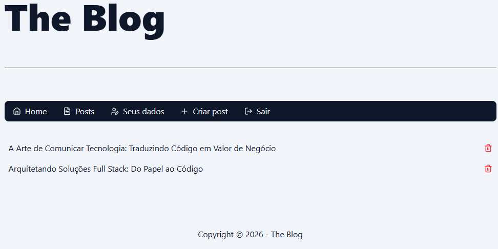
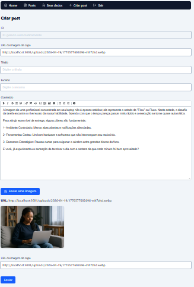

# 📝 The Blog - Full Stack Application

Este é um projeto de blog completo e funcional, desenvolvido para demonstrar habilidades em engenharia de software full stack. A aplicação conta com uma área administrativa para gestão de posts, sistema de autenticação, upload de imagens e uma interface pública performática.


---

## 🚀 Tecnologias

### **Front-End**
* **Framework:** Next.js 14+ (App Router)
* **Linguagem:** TypeScript
* **Estilização:** Tailwind CSS
* **Ícones:** Lucide React
* **Feedback:** React Toastify

### **Back-End**
* **Framework:** NestJS
* **Linguagem:** TypeScript
* **Banco de Dados:** PostgreSQL (Vercel Postgres)
* **ORM:** Drizzle ORM
* **Autenticação:** JWT (JSON Web Tokens)
* **Armazenamento:** Local Storage (Static Assets)

---

## 📂 Estrutura do Monorepo

O projeto está organizado em um sistema de monorepo para facilitar a manutenção e o gerenciamento:

* **/FrontEnd:** Aplicação Next.js com foco em SEO, renderização dinâmica e componentes de UI.
* **/BackEnd:** API robusta em NestJS com controle de acesso, filtros de exceção e serviços de upload.

---

## ✨ Funcionalidades Principais

* **Autenticação Completa:** Sistema de login seguro com proteção por Cookies e JWT.
* **Gestão de Posts (CRUD):** Criar, ler, editar e excluir postagens através de uma interface administrativa.
* **Upload de Imagens:** Upload de capas diretamente para o servidor com preview em tempo real no dashboard.
* **Filtro Anti-Bot:** Implementação de Honeypot em formulários sensíveis.
* **Middleware de Proteção:** Rotas administrativas protegidas via Next.js Middleware.

---

## 🛠️ Como rodar o projeto localmente

### 1. Clonar o repositório
```bash
git clone [https://github.com/LuizBarcelar/The-Blog.git](https://github.com/LuizBarcelar/The-Blog.git)
cd The-Blog
```

---

## 📸 Screenshots

| Home do Blog | Dashboard Admin | Preview de Upload |
| :---: | :---: | :---: |
|  |  |  |
